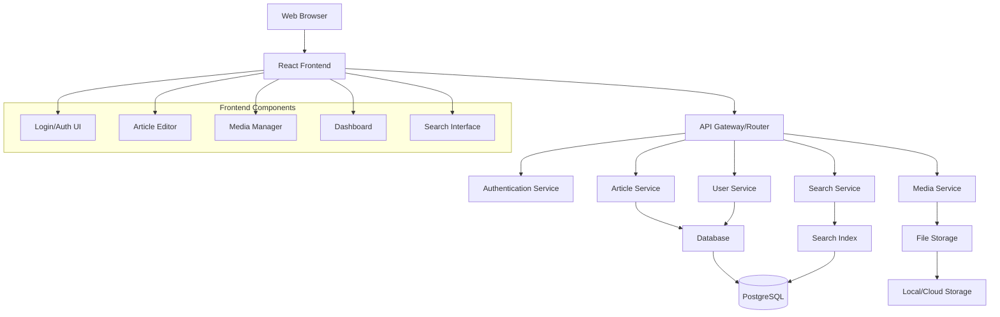

# Design Document

## Overview

The Simple CMS will be built as a web application with a clean separation between frontend and backend components. The system will use a modern web stack with a RESTful API architecture, supporting both web interface and potential future API integrations. The design emphasizes simplicity, maintainability, and scalability while meeting all functional requirements.

## Architecture

### High-Level Architecture



### Technology Stack
- **Frontend**: React with TypeScript, Material-UI/Bootstrap for UI components
- **State Management**: Redux Toolkit or React Context API
- **Rich Text Editor**: Draft.js, Quill, or TinyMCE for article editing
- **HTTP Client**: Axios for API communication
- **Backend**: Node.js with Express.js for API development
- **Database**: PostgreSQL for relational data storage
- **Search**: Full-text search using PostgreSQL's built-in capabilities (with option to upgrade to Elasticsearch)
- **Authentication**: JWT-based authentication with bcrypt for password hashing
- **File Storage**: Local filesystem with multer (with option to upgrade to AWS S3)
- **Image Processing**: Sharp for image optimization and resizing

## Components and Interfaces

### 1. User Management Component

**Responsibilities:**
- User registration and authentication
- Profile management
- Password reset functionality

**Key Interfaces:**
```typescript
interface User {
  id: string;
  username: string;
  email: string;
  passwordHash: string;
  createdAt: Date;
  updatedAt: Date;
  role: 'admin' | 'author' | 'reader';
}

interface AuthService {
  register(userData: RegisterRequest): Promise<User>;
  login(credentials: LoginRequest): Promise<AuthResponse>;
  resetPassword(email: string): Promise<void>;
  verifyToken(token: string): Promise<User>;
}
```

### 2. Article Management Component

**Responsibilities:**
- CRUD operations for articles
- Draft/publish status management
- Author association

**Key Interfaces:**
```typescript
interface Article {
  id: string;
  title: string;
  content: string;
  excerpt: string;
  authorId: string;
  status: 'draft' | 'published' | 'archived';
  createdAt: Date;
  updatedAt: Date;
  publishedAt?: Date;
  categoryIds: string[];
  tagIds: string[];
}

interface ArticleService {
  create(articleData: CreateArticleRequest): Promise<Article>;
  update(id: string, updates: UpdateArticleRequest): Promise<Article>;
  delete(id: string): Promise<void>;
  getById(id: string): Promise<Article>;
  getByAuthor(authorId: string): Promise<Article[]>;
  getPublished(pagination: PaginationOptions): Promise<PaginatedResult<Article>>;
}
```

### 3. Category Management Component

**Responsibilities:**
- Category CRUD operations
- Article-category associations

**Key Interfaces:**
```typescript
interface Category {
  id: string;
  name: string;
  description?: string;
  slug: string;
  createdAt: Date;
  updatedAt: Date;
}

interface CategoryService {
  create(categoryData: CreateCategoryRequest): Promise<Category>;
  update(id: string, updates: UpdateCategoryRequest): Promise<Category>;
  delete(id: string): Promise<void>;
  getAll(): Promise<Category[]>;
  getArticlesByCategory(categoryId: string): Promise<Article[]>;
}
```

### 4. Tag Management Component

**Responsibilities:**
- Tag creation and management
- Article-tag associations
- Tag cleanup for unused tags

**Key Interfaces:**
```typescript
interface Tag {
  id: string;
  name: string;
  slug: string;
  createdAt: Date;
  usageCount: number;
}

interface TagService {
  createOrGet(tagName: string): Promise<Tag>;
  getAll(): Promise<Tag[]>;
  getArticlesByTag(tagId: string): Promise<Article[]>;
  cleanupUnusedTags(): Promise<void>;
}
```

### 5. Search Component

**Responsibilities:**
- Full-text search across articles
- Search result ranking
- Search suggestions

**Key Interfaces:**
```typescript
interface SearchService {
  searchArticles(query: string, filters?: SearchFilters): Promise<SearchResult[]>;
  indexArticle(article: Article): Promise<void>;
  removeFromIndex(articleId: string): Promise<void>;
  getSuggestions(partialQuery: string): Promise<string[]>;
}

interface SearchResult {
  article: Article;
  relevanceScore: number;
  matchedFields: string[];
}
```

### 6. Media Management Component

**Responsibilities:**
- Image upload and storage
- File validation and security
- Image optimization and resizing
- Media library management

**Key Interfaces:**
```typescript
interface MediaFile {
  id: string;
  filename: string;
  originalName: string;
  mimeType: string;
  size: number;
  url: string;
  thumbnailUrl?: string;
  uploadedBy: string;
  createdAt: Date;
}

interface MediaService {
  uploadImage(file: Express.Multer.File, userId: string): Promise<MediaFile>;
  getMediaLibrary(userId?: string, pagination?: PaginationOptions): Promise<PaginatedResult<MediaFile>>;
  deleteMedia(id: string, userId: string): Promise<void>;
  optimizeImage(filePath: string): Promise<string>;
  generateThumbnail(filePath: string): Promise<string>;
}
```

### 7. Frontend Components

**Responsibilities:**
- User interface for all CMS operations
- State management and API integration
- Responsive design and user experience

**Key Components:**
```typescript
// Authentication Components
interface LoginForm {
  email: string;
  password: string;
  onSubmit: (credentials: LoginCredentials) => Promise<void>;
}

interface RegisterForm {
  username: string;
  email: string;
  password: string;
  confirmPassword: string;
  onSubmit: (userData: RegisterData) => Promise<void>;
}

// Article Management Components
interface ArticleEditor {
  article?: Article;
  onSave: (article: ArticleData) => Promise<void>;
  onPublish: (articleId: string) => Promise<void>;
  onImageUpload: (file: File) => Promise<string>;
}

interface ArticleList {
  articles: Article[];
  pagination: PaginationInfo;
  filters: ArticleFilters;
  onFilterChange: (filters: ArticleFilters) => void;
  onPageChange: (page: number) => void;
}

// Media Management Components
interface MediaLibrary {
  files: MediaFile[];
  onUpload: (files: FileList) => Promise<void>;
  onSelect: (file: MediaFile) => void;
  onDelete: (fileId: string) => Promise<void>;
}

// Search Components
interface SearchForm {
  query: string;
  filters: SearchFilters;
  onSearch: (query: string, filters: SearchFilters) => void;
}

interface SearchResults {
  results: SearchResult[];
  pagination: PaginationInfo;
  onPageChange: (page: number) => void;
}
```

## Data Models

### Database Schema

```sql
-- Users table
CREATE TABLE users (
  id UUID PRIMARY KEY DEFAULT gen_random_uuid(),
  username VARCHAR(50) UNIQUE NOT NULL,
  email VARCHAR(255) UNIQUE NOT NULL,
  password_hash VARCHAR(255) NOT NULL,
  role VARCHAR(20) DEFAULT 'author',
  created_at TIMESTAMP DEFAULT CURRENT_TIMESTAMP,
  updated_at TIMESTAMP DEFAULT CURRENT_TIMESTAMP
);

-- Categories table
CREATE TABLE categories (
  id UUID PRIMARY KEY DEFAULT gen_random_uuid(),
  name VARCHAR(100) UNIQUE NOT NULL,
  description TEXT,
  slug VARCHAR(100) UNIQUE NOT NULL,
  created_at TIMESTAMP DEFAULT CURRENT_TIMESTAMP,
  updated_at TIMESTAMP DEFAULT CURRENT_TIMESTAMP
);

-- Tags table
CREATE TABLE tags (
  id UUID PRIMARY KEY DEFAULT gen_random_uuid(),
  name VARCHAR(50) UNIQUE NOT NULL,
  slug VARCHAR(50) UNIQUE NOT NULL,
  usage_count INTEGER DEFAULT 0,
  created_at TIMESTAMP DEFAULT CURRENT_TIMESTAMP
);

-- Articles table
CREATE TABLE articles (
  id UUID PRIMARY KEY DEFAULT gen_random_uuid(),
  title VARCHAR(255) NOT NULL,
  content TEXT NOT NULL,
  excerpt TEXT,
  author_id UUID REFERENCES users(id),
  status VARCHAR(20) DEFAULT 'draft',
  created_at TIMESTAMP DEFAULT CURRENT_TIMESTAMP,
  updated_at TIMESTAMP DEFAULT CURRENT_TIMESTAMP,
  published_at TIMESTAMP
);

-- Article-Category junction table
CREATE TABLE article_categories (
  article_id UUID REFERENCES articles(id) ON DELETE CASCADE,
  category_id UUID REFERENCES categories(id) ON DELETE CASCADE,
  PRIMARY KEY (article_id, category_id)
);

-- Article-Tag junction table
CREATE TABLE article_tags (
  article_id UUID REFERENCES articles(id) ON DELETE CASCADE,
  tag_id UUID REFERENCES tags(id) ON DELETE CASCADE,
  PRIMARY KEY (article_id, tag_id)
);

-- Media files table
CREATE TABLE media_files (
  id UUID PRIMARY KEY DEFAULT gen_random_uuid(),
  filename VARCHAR(255) NOT NULL,
  original_name VARCHAR(255) NOT NULL,
  mime_type VARCHAR(100) NOT NULL,
  size INTEGER NOT NULL,
  url VARCHAR(500) NOT NULL,
  thumbnail_url VARCHAR(500),
  uploaded_by UUID REFERENCES users(id),
  created_at TIMESTAMP DEFAULT CURRENT_TIMESTAMP
);
```

### Search Index Structure

For PostgreSQL full-text search:
```sql
-- Add search vector column to articles
ALTER TABLE articles ADD COLUMN search_vector tsvector;

-- Create search index
CREATE INDEX articles_search_idx ON articles USING GIN(search_vector);

-- Create trigger to update search vector
CREATE OR REPLACE FUNCTION update_article_search_vector()
RETURNS TRIGGER AS $$
BEGIN
  NEW.search_vector := 
    setweight(to_tsvector('english', COALESCE(NEW.title, '')), 'A') ||
    setweight(to_tsvector('english', COALESCE(NEW.content, '')), 'B') ||
    setweight(to_tsvector('english', COALESCE(NEW.excerpt, '')), 'C');
  RETURN NEW;
END;
$$ LANGUAGE plpgsql;

CREATE TRIGGER update_article_search_trigger
  BEFORE INSERT OR UPDATE ON articles
  FOR EACH ROW EXECUTE FUNCTION update_article_search_vector();
```

## Error Handling

### Error Response Format
```typescript
interface ErrorResponse {
  error: {
    code: string;
    message: string;
    details?: any;
    timestamp: string;
  };
}
```

### Error Categories
1. **Validation Errors** (400): Invalid input data
2. **Authentication Errors** (401): Invalid credentials or expired tokens
3. **Authorization Errors** (403): Insufficient permissions
4. **Not Found Errors** (404): Resource doesn't exist
5. **Conflict Errors** (409): Duplicate resources or constraint violations
6. **Server Errors** (500): Internal system errors

### Error Handling Strategy
- Input validation at API layer using schema validation
- Database constraint violations handled gracefully
- Comprehensive logging for debugging
- User-friendly error messages for frontend
- Retry mechanisms for transient failures

## Testing Strategy

### Unit Testing
- **Models**: Test data validation and business logic
- **Services**: Test core business operations with mocked dependencies
- **Controllers**: Test API endpoints with mocked services
- **Utilities**: Test helper functions and utilities

### Integration Testing
- **Database Operations**: Test actual database interactions
- **API Endpoints**: Test complete request/response cycles
- **Authentication Flow**: Test login, registration, and token validation
- **Search Functionality**: Test search queries and indexing

### End-to-End Testing
- **User Workflows**: Test complete user journeys (registration → login → create article → publish)
- **Content Management**: Test article creation, editing, and publishing workflows
- **Search and Discovery**: Test search functionality and content browsing

### Testing Tools
- **Unit/Integration**: Jest with supertest for API testing
- **E2E**: Playwright or Cypress for browser automation
- **Database**: Test database with Docker containers
- **Mocking**: Jest mocks for external dependencies

### Test Data Management
- Seed data for consistent testing environments
- Factory functions for creating test objects
- Database cleanup between tests
- Separate test database configuration